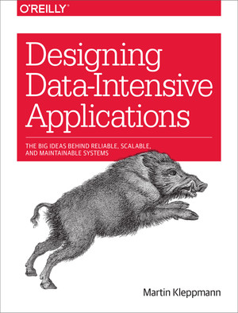

# Designing Data-Intensive Applications — Implementation

<p align="center">
  
</p>

A hands-on exploration of distributed systems concepts from Martin Kleppmann's *Designing Data-Intensive Applications*. Each module implements core ideas from the book with working Python code.

## Modules

| Module | Topic | Key Concepts |
|--------|-------|--------------|
| [01_reliability_service](./01_reliability_service/) | Reliability & Fault Tolerance | Circuit breakers, rate limiting, retries with backoff |
| [02_multi_model_api](./02_multi_model_api/) | Data Models | Relational, document, and graph storage with unified API |
| [03_storage_engine](./03_storage_engine/) | Storage Engines | Log-structured storage, LSM-trees, SSTables, Bloom filters |
| [04_versioned_encoding](./04_versioned_encoding/) | Encoding & Evolution | Schema versioning, forward/backward compatibility |
| [05_replicated_store](./05_replicated_store/) | Replication | Leader-follower replication, WAL, consistency guarantees |
| [06_sharded_store](./06_sharded_store/) | Partitioning | Consistent hashing, shard routing, rebalancing |
| [07_transaction_system](./07_transaction_system/) | Transactions | MVCC, isolation levels, serializable snapshot isolation |
| [08_partition_failures](./08_partition_failures/) | Distributed Failures | Network partitions, failure detectors, CRDTs |
| [09_consensus_store](./09_consensus_store/) | Consensus | Raft algorithm, replicated state machines |

## Quick Start

Each module is self-contained. No external dependencies required beyond Python 3.8+.

```bash
# Run any module directly
cd 01_reliability_service
python server.py &
python client.py

# Or run the tests/demos
cd 07_transaction_system
python anomalies.py
```

## Architecture

```
┌─────────────────────────────────────────────────────────────────┐
│                         Client Layer                             │
├─────────────────────────────────────────────────────────────────┤
│  Circuit Breakers │ Rate Limiters │ Retry Policies │ Routing    │
├─────────────────────────────────────────────────────────────────┤
│                      Consensus (Raft)                            │
├─────────────────────────────────────────────────────────────────┤
│  Replication │ Partitioning │ Transactions │ Failure Detection  │
├─────────────────────────────────────────────────────────────────┤
│                      Storage Engines                             │
│  Log-Structured │ LSM-Trees │ SSTables │ Compaction │ Indexing  │
├─────────────────────────────────────────────────────────────────┤
│                      Encoding Layer                              │
│  Schema Evolution │ Binary Encoding │ Versioning                │
└─────────────────────────────────────────────────────────────────┘
```

## Module Highlights

### Reliability Patterns
Implements production-ready patterns for handling failures gracefully—circuit breakers that trip after consecutive failures, sliding-window rate limiters, and exponential backoff with jitter.

### Multi-Model Storage
A unified API that works with relational (SQLite), document (JSON files), and graph (in-memory with adjacency lists) backends. Demonstrates how the same data can be modeled differently.

### Log-Structured Storage
A complete storage engine with append-only log segments, sparse indexes, Bloom filters for fast negative lookups, and background compaction to reclaim space.

### Schema Evolution
Binary encoding format supporting schema versioning with forward and backward compatibility. New fields get defaults, removed fields are ignored, type changes are detected.

### Replication
Leader-follower replication with write-ahead logging, configurable sync modes (async, semi-sync), and read-your-writes consistency for clients.

### Partitioning
Consistent hashing with virtual nodes for even distribution. Supports adding/removing shards with automatic data migration and rebalancing.

### Transactions
Full MVCC implementation with multiple isolation levels: read uncommitted, read committed, repeatable read, and snapshot isolation. Plus serializable snapshot isolation (SSI) that detects write skew anomalies.

### Failure Handling
Network partition simulation, phi accrual failure detector for adaptive timeouts, gossip-based failure detection, and CRDT counters (G-Counter, PN-Counter) that converge after partitions heal.

### Consensus
Complete Raft implementation with leader election, log replication, and safety guarantees. Includes persistent log, metadata storage, and pluggable state machines.

## Learning Path

Suggested order for working through the modules:

1. **03_storage_engine** — Start with how data is actually stored
2. **04_versioned_encoding** — Understand data serialization
3. **01_reliability_service** — Build resilient clients
4. **02_multi_model_api** — Compare data modeling approaches
5. **05_replicated_store** — Add redundancy
6. **06_sharded_store** — Scale horizontally
7. **07_transaction_system** — Ensure correctness
8. **08_partition_failures** — Handle the inevitable
9. **09_consensus_store** — Achieve distributed agreement

## References

- Kleppmann, M. (2017). *Designing Data-Intensive Applications*. O'Reilly Media.
- Ongaro, D., & Ousterhout, J. (2014). In Search of an Understandable Consensus Algorithm (Raft).
- Shapiro, M., et al. (2011). Conflict-free Replicated Data Types.


